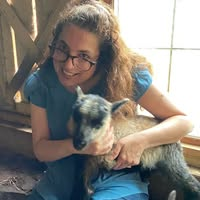

## Professional History

Dr. Carolyn Rosé is the Kavcic-Moura Professor of Language Technologies and Human-Computer Interaction in the School of Computer Science at Carnegie Mellon, Program Director for the Masters of Computational Data Science Program and the Language Technologies Institute undergraduate programs.  She completed her PhD in Language and Information Technologies at Carnegie Mellon University in 1998, where she was the second student (first female!) to earn a PhD from the Language Technologies Institute.  She then moved on to a position as a Researcher at the Learning Research and Development Center from October 1998 until October 2003 when she returned to Carnegie Mellon University's School of Computer Science with a joint appointment between the Language Technologies Institute and the Human-Computer Interaction Institute.  From August 2021 until August 2023 she served as Interim Department Head of the Language Technologies Institute.  In Summer of 2023, she directed <a href="https://www.cs.cmu.edu/generative-ai/"> CMU's Generative AI Innovation Incubator</a>.  The videos of all of the online events are available online <a href="https://www.youtube.com/playlist?list=PLttXoftVKwlCnN4NDxjIJj1RcFtJUz3d8"> as a Youtube playlist</a>. From Spring 2019 through Spring 2025 she served as an NLP expert at the National Institutes of Health Rehabilitation Medicine Department.

Her research group’s highly interdisciplinary work, published in over 330 peer reviewed publications, is represented in the top venues of 5 fields: namely, Language Technologies, Learning Sciences, Cognitive Science, Educational Technology, and Human-Computer Interaction, with awards in 4 of these fields.  She is a Past President and Inaugural Fellow of the International Society of the Learning Sciences, Senior member of IEEE, Founding Chair of the International Alliance to Advance Learning in the Digital Era, and Executive Editor (formerly Co-Editor-in-Chief) of the International Journal of Computer-Supported Collaborative Learning.  She also serves as a 2020-2021 AAAS Leshner Leadership Institute Fellow for Public Engagement with Science, with a focus on public engagement with Artificial Intelligence. 

---

## Personal

Dr. Carolyn Rosé is deeply committed to her work but is also pleased to enjoy a full life outside of work with family and friends.  She especially enjoys gardening, cooking, a variety of wool related craft hobbies (spinning, weaving, knitting, and crochet), long walks in the woods, and yoga.
