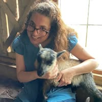
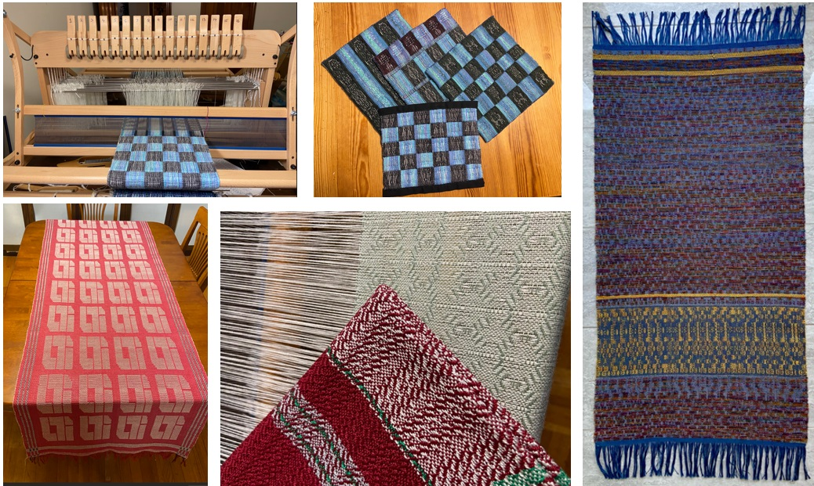

## Professional History

Dr. Carolyn Rosé is Kavčić-Moura Professor of Language Technologies and Human-Computer Interaction in the School of Computer Science at Carnegie Mellon University (USA).  She earned a Masters in Computational Linguistics in 1994 and a PhD in Language and Information Technologies in 1998, both from Carnegie Mellon University.  She was research faculty at the University of Pittsburgh's Learning Research and Development Center for 6 years and then returned to Carnegie Mellon University as faculty in 2003.  Her leadership profile includes completed major university-internal leadership roles at the university, college, and department level in addition to external research society leadership and collaborations with industry and government as highlighted below.

Her completed university leadership roles include Interim Director of the Language Technologies Institute, Director of the Language Technologies Institute’s largest professional masters program - the Master of Computational Data Science, Director of Language Technologies Undergraduate Programs, Faculty senate member, and Vice Chair of the University Education Council. She also launched two online certificates, namely Machine Learning and Data Science (ranked at #2 in the US for AI certificates) and Generative AI and Large Language Models. In Summer of 2023, she directed <a href="https://www.cs.cmu.edu/generative-ai/"> CMU's Generative AI Innovation Incubator</a>.  The videos of all of the online events are available online <a href="https://www.youtube.com/playlist?list=PLttXoftVKwlCnN4NDxjIJj1RcFtJUz3d8"> as a Youtube playlist</a> with over 11K views to date.  She has mentored 23 PhD students (20 in Language Technologies, 16 already graduated), over 100 masters students (79 in Language Technologies), 9 post-doctoral fellows, and over 20 undergraduates.   

Her external service leadership positions in major research societies include board positions (president, secretary, treasurer), journal editorial board leadership (co-editor-in-chief, executive editor, associate editor), conference/workshop leadership (organizer, program chair), and cross-society coordination (founding director of a meta-society organization). In particular, she has been active in service to the Association for Computational Linguistics, having recently served as program co-chair for EMNLP 2025 as well as on numerous other program committees, co-organizer of two shared tasks (CODI-CRAC 2021 and 2022), keynote speaker at ACL 2018, program co-chair for discourse for SIGDIAL 2015, editorial board member of the Journal of Dialogue Systems (now the Journal of Discourse and Dialogue) since 2006, reviewer for the Computational Linguistics journal, and member of the SIGDAT Advisory Board (2026-).  Beyond the ACL community, she is a Past President and Inaugural Fellow of the International Society of the Learning Sciences, Senior member of IEEE, Founding Chair of the International Alliance to Advance Learning in the Digital Era, and Executive Editor (formerly Co-Editor-in-Chief) of the International Journal of Computer-Supported Collaborative Learning (ijCSCL, impact factor 6.8) as well as guest co-editor of an ijCSCL special issue on Artificial Intelligence in CSCL: Discerning Promising Opportunities while Avoiding Pitfalls in Light of Past Accomplishments and Recent Advances.  She is also a AAAS Leshner Leadership Institute Fellow for Public Engagement with Science (AI Cohort, 2020-2021).  

Her industry partnerships have included Google, Oracle, Microsoft, Amazon, Verilog, Realyze, Abridge AI, and Dow Chemical as well as foundations such as the Gates Foundation and the Schmidt Foundation.  She is second time faculty co-lead for CMU’s Amazon Nova AI Challenge team.  At the government level she collaborated on decision support technology development for 6 years with NLP teams at the National Institutes of Health (USA) and the Social Security Administration (USA). 

---

## Personal

Dr. Carolyn Rosé is deeply committed to her work but is also pleased to enjoy a full life outside of work with family and friends.  She especially enjoys gardening, cooking, a variety of wool related craft hobbies (spinning, weaving, knitting, and crochet), long walks in the woods, and yoga.

