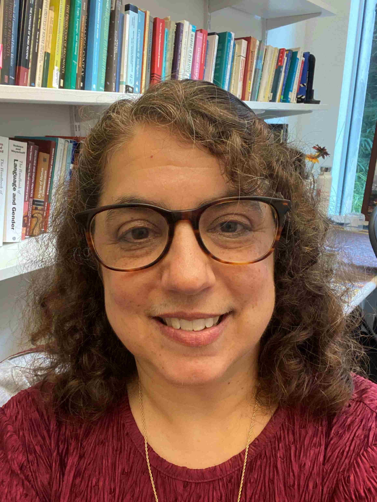

**Carolyn Penstein Rosé**  
Kavcic-Moura Professor of Language Technologies and Human-Computer Interaction 
Carnegie Mellon University  
Language Technologies Institute and Human-Computer Interaction Institute  
Gates-Hillman Center 5515  
5000 Forbes Ave.  
Pittsburgh, PA 15213-3891  
Email: [cprose@cs.cmu.edu](mailto:cprose@cs.cmu.edu)  
Phone: +1 (412) 268-7130  
Fax: +1 (412) 268-6298  

---

## Welcome to my webpage!

I have the privilege of directing the Teledia lab, a large, interdisciplinary lab involving PhD, Masters, and undergraduate students, staff, and affiliates researching interactive and explainable Sociotechnical Artificial Intelligence from a highly interdisciplinary perspective. Our team is highly collaborative, offering students many opportunities to explore new horizons as well as expand their impact by developing and then contributing their own unique expertise and research creations to numerous synergistic efforts.

---

## Teledia News

- Carolyn Rosé was selected for the Kavcic-Moura Endowed Professorship of Lannguage Technologies and Human-Computer Interaction
- [Atharva Naik](https://atharva-naik.github.io/) is student lead for the CMU team of [the Amazon Trusted AI Challenge](https://www.amazon.science/amazon-nova-ai-challenge-accelerating-the-field-of-generative-ai)
- Carolyn Rosé is Program Co-chair for EMNLP 2025
- Carolyn Rosé is guest co-Editor for a special issue of the International Journal of Computer-Supported Collaborative Learing on Artificial Intelligence in Collaborative Learning
- [Armineh Nourbakhsh](https://scholar.google.com/citations?user=Itf3MeIAAAAJ&hl=en) successfully defended her dissertation on March 18, 2025
- [Sreecharan Sankaranarayanan](https://www.linkedin.com/in/sreecharansankaranarayanan/) successfully defended his dissertation on March 7, 2025
- [Ritam Dutt](https://shorit.github.io/) was awarded an Honorable Mention at the EMNLP 2024 GenBench workshop
- [Atharva Naik](https://atharva-naik.github.io/) was nominated for a Best Paper Award at AIED 2024
- [YiQing Xie](https://yiqingxyq.github.io/) was awarded the 2024/2025 LTI Presidential Fellowship

---

## Recent/Upcoming Invited Talks

- **Keynote Speaker**: Global Smart Education Conference (GSE2025), co-organized by Beijing Normal University (BNU) and UNESCO Institute for Information Technologies in Education (UNESCO IITE) August 2025 (remote delivery)
- **Keynote Speaker**: 10th International Conference on Computer and Information Science and Technology, Paris, France (CIST 2025) August 2025 (remote delivery)
- **Keynote Speaker**: International Conference on AI in Healthcare, July 2025, https://researchsummits.com/conf12.html 
- **Invited Speaker**: Symposium on Exploring Human-AI Interactions Across Various Learning Tasks: Diverse Perspectives on Augmenting Learning, Annual Meeting of the International Society of the Learning Sciences, Helsinki, Finland, June 2025
- **Keynote Speaker**: 8th  International Conference on Computational Intelligence and Data Science (ICCIDS 2025) Spring 2025 (remote delivery)
- **Invited Speaker**: Minerva Gentner Symposium "Green NLP for Understanding Complex Information", May 21 to 23, 2024, Birlinghoven castle, Germany
- **Invited Speaker**: IPAI Distinguished Seminar talk, Seoul National University, Korea, Spring 2025
- **Invited Panelist**: Human-Centered Large Language Modeling Workshop, Annual Meeting of the Association for Computational Linguistics, Summer 2024
- **Keynote Speaker**: Annual Meeting of the International Educational Data Mining Society (EDM), July 16, 2024

---

## Professional Affiliations

- Past President and Inaugural Fellow of [The International Society of the Learning Sciences](https://www.isls.org/) 
- IEEE Senior Member
- AAAS Leshner Leadership Fellow for Public Engagement with Science: [AI Cohort](https://www.aaas.org/programs/leshner-institute)
- Association for Computational Linguistics (CL Journal editorial board)

---

## Publications

For a comprehensive list of my publications, please visit my [Google Scholar Profile](https://scholar.google.com/citations?user=BMydCgcAAAAJ).

---
