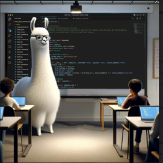

## Research Interests

Our research advances the concept of Sociotechnical Artifical Intelligence from a highly multidisciplinary perspective, exploring human-AI complementarity and multi-agent human-AI teaming.  From a machine learning perspective, my research team pushes the frontier of learnability and generalizability through deeply data-focused explorations of inductive biases. In particular, we develop and explore novel representations and architectural elements using a problem-driven approach motivated by error analysis and exploratory data analysis, with a current emphasis on abstraction and decomposition, which are arguably two of the greatest challenges for LLMs. We investigate these issues across multiple problem areas including multimodal conversational process analysis, multimodal document understanding, clinical text processing, knowledge-based question answering, and language models of code. Our work is particularly known for the way it bridges between deep, theoretical insights from theories of language and interaction on the one side (e.g., social psychology and cognitive psychology, sociolinguistics, and discourse analysis) and computational modeling technology on the other (e.g., deep learning, LLMs, neurosymbolic reasoning). The key enabler of effective machine learning is the measurement of capabilities, operationalized in computational objectives, and embodied in benchmarks. We have collaborated on the development of benchmarks and challenge data sets in coreference for dialogue, textual entailment, and event ordering, and are working on new benchmarks for code translation and code review.

My 3+ decades long passion is to use technology to positively impact human learning. Building on my group’s computational advances, with numerous papers published at top conferences in Language Technologies, our research has birthed and substantially contributed to the growth of two thriving interrelated areas of research in the Learning Sciences: namely, Automated Analysis of Collaborative Learning Processes and Dynamic Support for Collaborative Learning, with demonstrations of efficacy in numerous classroom studies where these interventions have frequently been associated with increases in learning on average of a letter grade or more. Recent work employs LLM agents to support learning in collaborative software teams. Other recent work focuses on AI Literacy, including work to address perception and effectiveness of LLM guardrails as well as developing curricula and learning technologies to engage K12 students in learning about artificial intelligence and machine learning.

